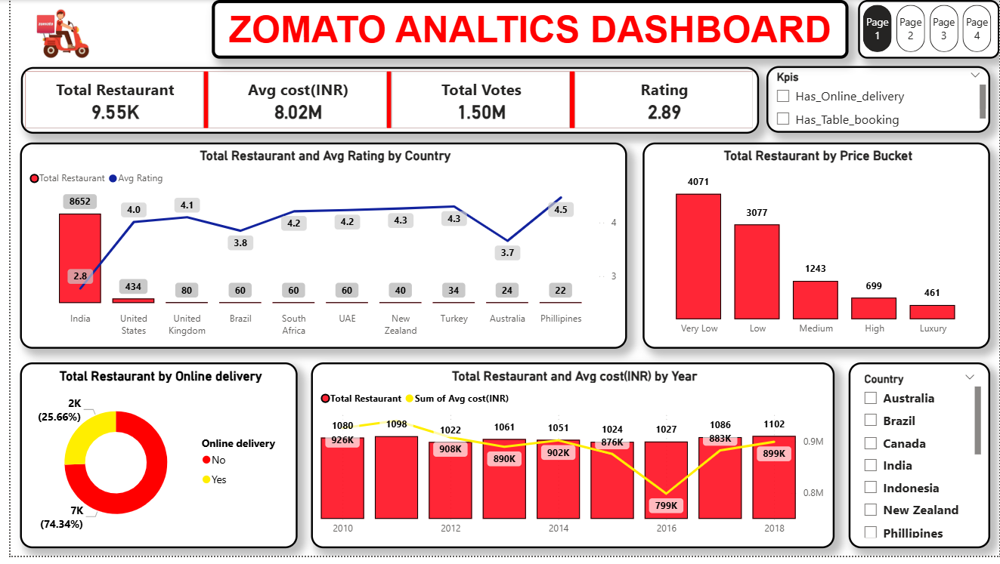
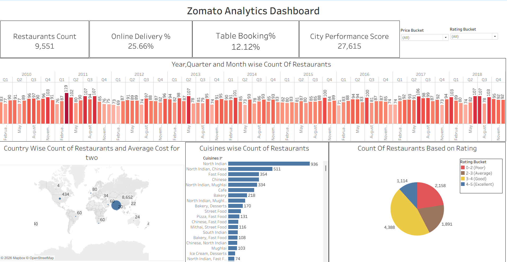

# 🍽️ Zomato Analytics Project

## 📌 Project Overview

The Zomato Analytics Project was developed to analyze restaurant data and uncover meaningful business insights related to customer preferences, restaurant performance, pricing trends, and online delivery services.

Using SQL, Excel, Tableau, and Power BI, the project focuses on transforming raw restaurant data into interactive dashboards and actionable insights that support better decision-making.

This project demonstrates the complete data analytics workflow including data cleaning, querying, KPI analysis, visualization, and business storytelling.

---

## 🎯 Business Objectives

- Analyze restaurant distribution across countries and cities
- Understand customer rating patterns and restaurant performance
- Evaluate online delivery and table booking availability
- Identify pricing trends using average cost analysis
- Discover popular cuisines and customer preferences
- Build interactive dashboards for business reporting

---

## 🛠️ Tools & Technologies Used

| Tool | Purpose |
|---|---|
| SQL | Data querying and KPI analysis |
| Power BI | Interactive dashboard development |
| Tableau | Data visualization and storytelling |
| Microsoft Excel | Data cleaning and exploratory analysis |
| CSV Dataset | Raw and cleaned data source |

---

## 📊 Dashboard Highlights

### Power BI Dashboard
The Power BI dashboard provides interactive visualizations for:
- Restaurant distribution analysis
- Ratings and customer feedback analysis
- Online delivery insights
- Table booking trends
- Price bucket segmentation
- Cuisine-based analysis

---

### Tableau Dashboard
The Tableau dashboard focuses on visual storytelling and trend analysis using restaurant and customer data.

---

## 📈 Key Insights

- Certain cities showed significantly higher restaurant concentration compared to others
- Restaurants offering online delivery had stronger customer engagement
- Mid-range priced restaurants formed the largest category in the dataset
- Popular cuisines varied across different countries and cities
- Higher-rated restaurants generally had better service-related features

---

## 📂 Project Files

| File Name | Description |
|---|---|
| `powerbi-dashboard.pbix` | Power BI dashboard file |
| `tableau-dashboard.twbx` | Tableau dashboard file |
| `zomato-sql-analysis.sql` | SQL queries used for analysis |
| `zomato-analysis.xlsx` | Excel-based data analysis |
| `zomato_cleaned.csv` | Cleaned Zomato dataset |
| `country-code.csv` | Country mapping dataset |

---

## 💡 Skills Demonstrated

- Data Cleaning & Transformation
- SQL Querying
- Dashboard Development
- KPI Analysis
- Data Visualization
- Business Intelligence
- Analytical Thinking
- Data Storytelling

---

## 🚀 Project Outcome

This project helped strengthen practical knowledge in data analytics by combining multiple tools to solve business-related problems and present insights through interactive dashboards.

The analysis provides a better understanding of restaurant trends, customer behavior, and operational patterns within the food delivery industry.

---

## 👤 Author

**Rahul Kumar**  
Aspiring Data Analyst

