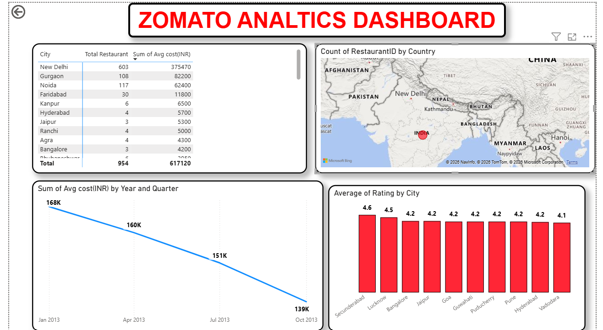
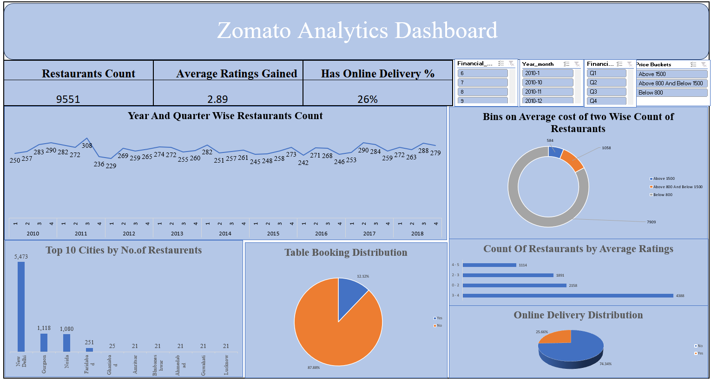

# 🍽️ Zomato Analytics Project

---

## 📌 Project Overview

The Zomato Analytics Project was developed to analyze restaurant data and uncover meaningful business insights related to customer preferences, restaurant performance, pricing trends, and online delivery services.

Using SQL, Excel, Tableau, and Power BI, the project focuses on transforming raw restaurant data into interactive dashboards and actionable insights that support data-driven decision-making.

This project demonstrates the complete analytics workflow including:
- Data Cleaning
- SQL Querying
- KPI Development
- Dashboard Design
- Data Visualization
- Business Storytelling

---

## 🎯 Business Objectives

- Analyze restaurant distribution across countries and cities
- Understand customer rating patterns and restaurant performance
- Evaluate online delivery and table booking availability
- Identify pricing trends using average cost analysis
- Discover popular cuisines and customer preferences
- Build interactive dashboards for business reporting

---

## 🛠️ Tools & Technologies Used

| Tool | Purpose |
|---|---|
| SQL | Data querying and KPI analysis |
| Power BI | Interactive dashboard development |
| Tableau | Data visualization and storytelling |
| Microsoft Excel | Data cleaning and exploratory analysis |
| CSV Dataset | Raw and cleaned data source |

---

# 📊 Dashboard Highlights

## 📈 Power BI Dashboard

The Power BI dashboard was developed to analyze restaurant trends, customer ratings, pricing categories, and service-related insights through interactive visualizations.

### Dashboard Features
- Restaurant Distribution Analysis
- Ratings & Customer Feedback Analysis
- Online Delivery Insights
- Table Booking Trends
- Price Bucket Segmentation
- Cuisine Analysis
- Interactive KPI Cards & Filters

📄 [View Power BI Dashboard](./powerbi-dashboard.pbix)

---

## 📊 Tableau Dashboard

The Tableau dashboard focuses on visual storytelling and trend analysis using restaurant and customer data.

### Dashboard Features
- Interactive Visualizations
- Cuisine Trend Analysis
- Customer Rating Insights
- City-wise Restaurant Analysis
- Business Trend Reporting

📄 [View Tableau Dashboard](./tableau-dashboard.twbx)

---

## 📑 Excel Dashboard

The Excel dashboard was created to perform exploratory data analysis and KPI reporting using pivot tables, charts, slicers, and interactive reporting techniques.

### Dashboard Features
- KPI Tracking
- Restaurant Distribution Analysis
- Ratings Analysis
- Pricing Insights
- Interactive Filters & Slicers
- Data Cleaning & Validation

📄 [View Excel Dashboard](./zomato-analysis.xlsx)

---

## 🗃️ SQL Analysis

SQL was used to perform data extraction, KPI calculations, trend analysis, and business queries from the Zomato dataset.

### SQL Tasks Performed
- Restaurant Count Analysis
- Rating Distribution Analysis
- Country & City-Based Analysis
- Online Delivery Insights
- Table Booking Analysis
- Price Bucket Segmentation
- KPI Calculations

📄 [View SQL Queries](./zomato-sql-analysis.sql)

---

## 📈 Key Insights

- Certain cities showed significantly higher restaurant concentration compared to others
- Restaurants offering online delivery showed stronger customer engagement
- Mid-range priced restaurants formed the largest category in the dataset
- Popular cuisines varied across different countries and cities
- Higher-rated restaurants generally had better service-related features
- Online delivery availability played an important role in customer convenience and restaurant visibility

---

## 📂 Project Files

| File Name | Description |
|---|---|
| `powerbi-dashboard.pbix` | Power BI dashboard file |
| `tableau-dashboard.twbx` | Tableau dashboard file |
| `zomato-sql-analysis.sql` | SQL queries used for analysis |
| `zomato-analysis.xlsx` | Excel-based dashboard and analysis |
| `zomato_cleaned.csv` | Cleaned Zomato dataset |
| `country-code.csv` | Country mapping dataset |

---

## 💡 Skills Demonstrated

- Data Cleaning & Transformation
- SQL Querying
- Dashboard Development
- KPI Analysis
- Data Visualization
- Business Intelligence
- Analytical Thinking
- Data Storytelling
- Exploratory Data Analysis

---

## 🚀 Project Outcome

This project strengthened practical knowledge in data analytics by combining multiple analytical tools to solve business-related problems and present insights through interactive dashboards.

The analysis provides a deeper understanding of restaurant trends, customer behavior, pricing patterns, and operational insights within the food delivery industry.

---

## 👤 Author

**Rahul Kumar**  
Aspiring Data Analyst
