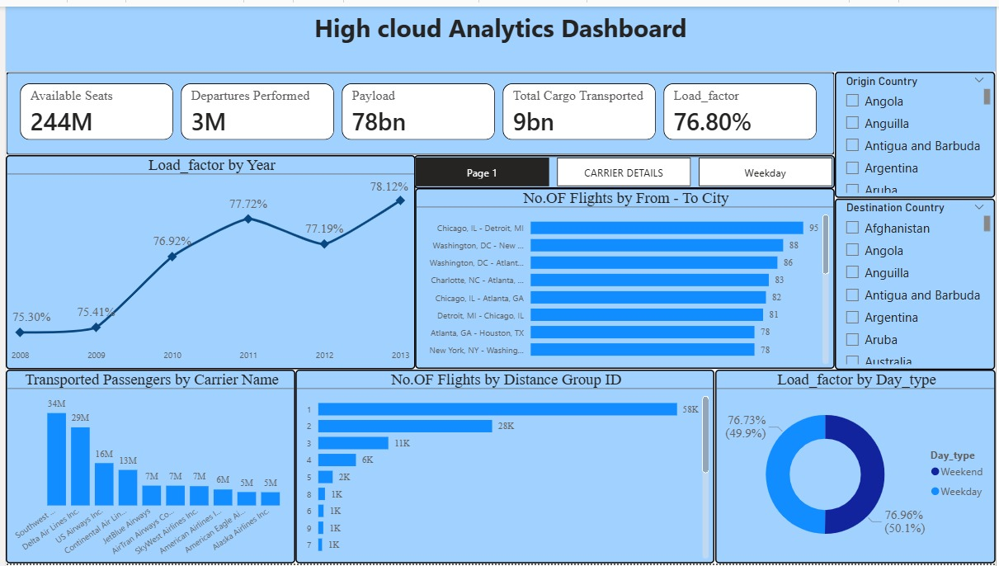
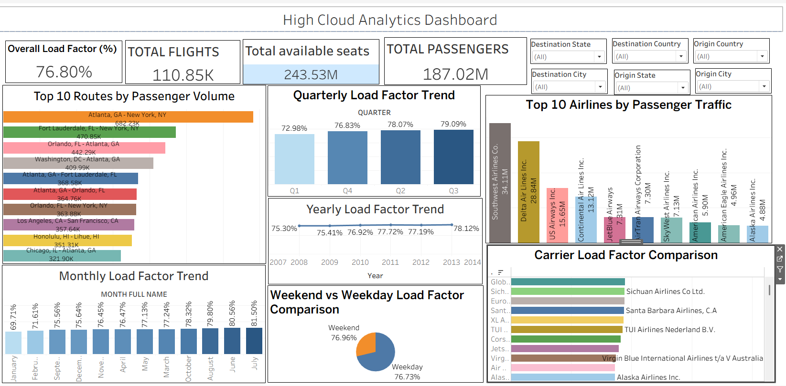
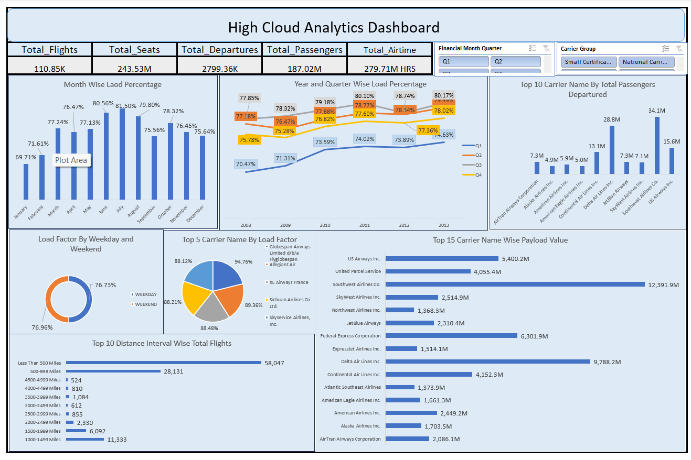

# ☁️ High Cloud Sales & Customer Analysis

📊 End-to-end data analysis project using SQL, Power BI, Tableau & Excel

---

## 📌 Overview

This project analyzes High Cloud business data to understand sales performance, customer behavior, and revenue trends.

---

## 🎯 Business Problem

* Identify top-performing products
* Analyze customer purchase behavior
* Track revenue trends
* Improve business decision-making

---

## 🧰 Tools Used

* SQL
* Power BI
* Tableau
* Excel

---

## 📊 Dashboards
### 🔹 Power BI Dashboard

### 🔹 Tableau Dashboard

### 🔹 Excel Dashboard

---

## 💡 Business Impact

- Improved understanding of customer behavior  
- Identified high-performing products  
- Highlighted revenue-driving regions  
- Supported data-driven decision making

 ---
## 📈 Key Insights

* Top products contribute majority of revenue
* Repeat customers generate higher value
* Certain regions perform better than others

* ## ▶️ How to Use

1. Download dataset  
2. Open Power BI file (.pbix)  
3. Explore Tableau dashboard  
4. Run SQL queries  
5. Check Excel dashboard  

---

## 📁 Project Files

- Power BI Dashboard (.pbix)  
- Tableau Dashboard (.twbx)  
- Excel Dashboard (.xlsx)  
- SQL Script (.sql)  
- Dataset (.zip)  

---
