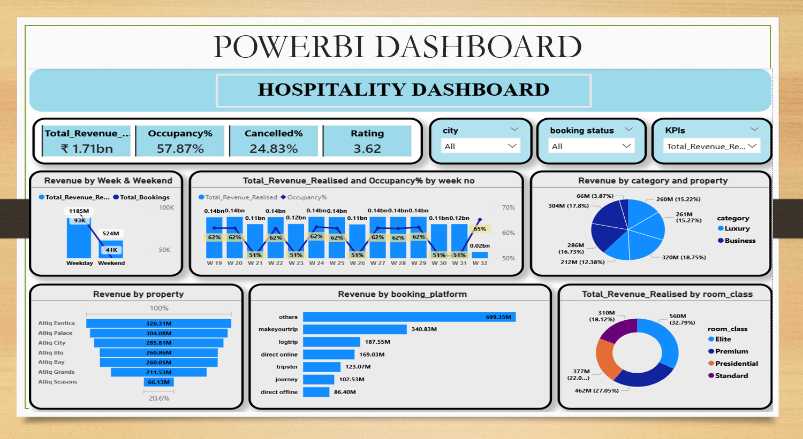
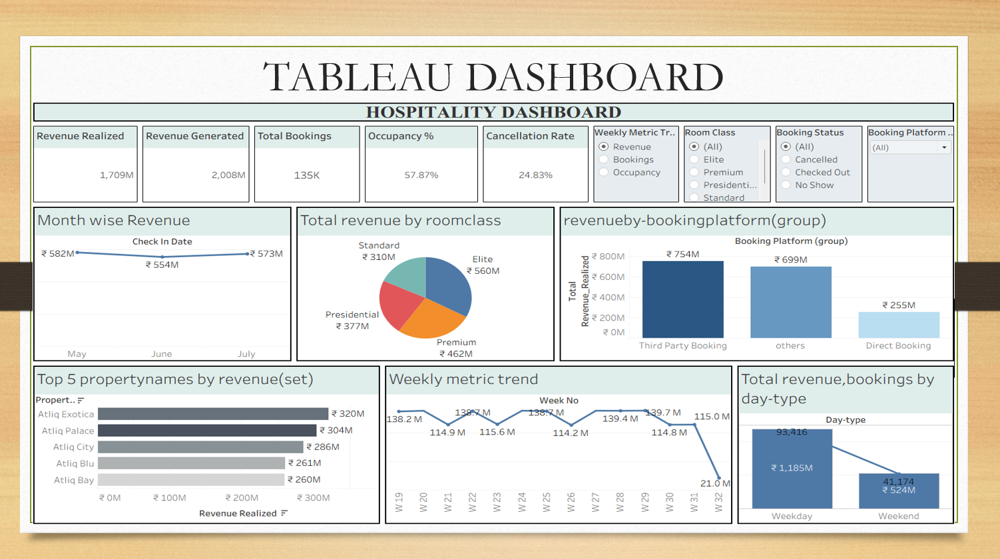
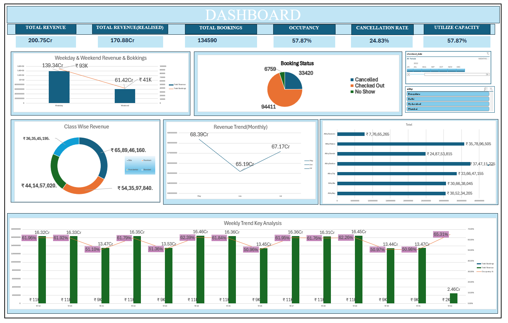

# 🏨 Hospitality Dashboard Analysis

## 📌 Overview

This project analyzes hotel booking data to understand revenue, occupancy, and customer behavior.

## 🧰 Tools Used

* Power BI
* Tableau
* Excel
* SQL

## 📊 Key Metrics

* Total Revenue
* Occupancy %
* Cancellation Rate
* Total Bookings

## 📈 Key Insights

* Weekend bookings are lower than weekdays
* Third-party platforms generate most revenue
* Cancellation rate impacts revenue significantly

## 📷 Dashboards
### 🔹 Power BI Dashboard

### 🔹 Tableau Dashboard

### 🔹 Excel Dashboard

## 💡 Business Impact

- Identified high cancellation impact on revenue  
- Highlighted top-performing booking platforms  
- Analyzed weekday vs weekend trends  
- Suggested strategies to improve occupancy
## ▶️ How to Use

1. Download dataset from repository  
2. Open Power BI file (.pbix)  
3. Explore Tableau dashboard (.twbx)  
4. Use SQL file for queries  
5. Check Excel dashboard for summary insights  

---

## 📁 Project Files

- Power BI Dashboard (.pbix)  
- Tableau Dashboard (.twbx)  
- Excel Dashboard (.xlsx)  
- SQL Script (.sql)  
- Dataset (.zip)  
